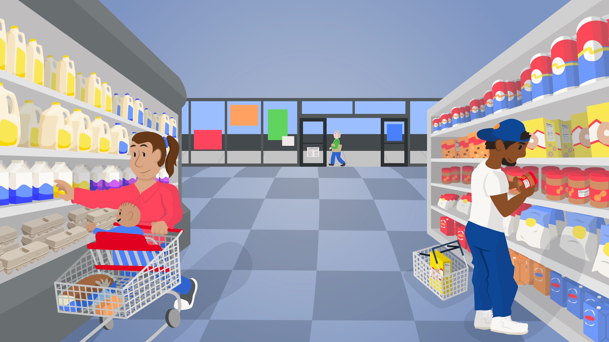

# Jenna Cohen - Work Samples

I’m Jenna Cohen, a visual journalist experienced in using everything from motion graphics and data visualization to photography and design to produce content that is accurate, digestible and engaging.

Below are some pieces that demonstrate my passion for this work and the skills I have.

<a href="https://www.pbs.org/newshour/features/smart-shopping-quiz/"><kbd></kbd></a>

## [Quiz: Are You A Smart Shopper?](https://www.pbs.org/newshour/features/smart-shopping-quiz/)

As food prices have risen due to factors such as inflation, I worked with members of the NewsHour digital and product team to design and develop an interactive web page where users can learn how to best shop on a budget, then take our quiz to test their skills. The interactive led our site for engagement time on a single page during the week following publication. It was also featured on our [broadcast program](https://www.youtube.com/watch?v=emErLPu0-O0&t=12s).

**My role:**

- Data reporting and analysis: Google Sheets
- Interface design: Figma
- Development: HTML, CSS, JavaScript, GitHub, WordPress

<a href="https://www.pbs.org/newshour/nation/how-south-dakota-voters-could-help-save-the-lives-of-uninsured-moms"><kbd></kbd></a>

## [Here’s what the pregnant and uninsured face in South Dakota](https://www.pbs.org/newshour/nation/how-south-dakota-voters-could-help-save-the-lives-of-uninsured-moms)

In 2022, one out of 10 South Dakotans didn’t have health insurance, according to the Census Bureau. I worked alongside our health reporter to coordinate resources and gather data in South Dakota, visualized data in a static chart and interactive map, and customized the page layout in our CMS to highlight key quotes, photography, and side stories.

**My role:**

- Data reporting and analysis: Google Sheets
- Coordinating photographer based in South Dakota
- Information graphic design: Illustrator, Datawrapper
- Interface design: HTML, CSS, WordPress

<a href="https://www.pbs.org/newshour/health/support-for-abortion-rights-has-grown-in-spite-of-bans-and-restrictions-poll-shows"><kbd></kbd></a>

## [Support for abortion rights has grown in spite of bans and restrictions, poll shows](https://www.pbs.org/newshour/health/support-for-abortion-rights-has-grown-in-spite-of-bans-and-restrictions-poll-shows)

Support for abortion rights overall has increased as state legislatures and courtrooms have instituted a growing number of restrictions and bans, according to an April 2023 PBS NewsHour/NPR/Marist poll. I worked with our politics and polling team to visualize our poll data for [our site](https://www.pbs.org/newshour/health/support-for-abortion-rights-has-grown-in-spite-of-bans-and-restrictions-poll-shows) and [social platforms](https://www.instagram.com/p/CrgyX8JtGpi/?img_index=2).

**My role:**

- Data analysis and analysis: Google Sheets
- Data visualization: Google Sheets, Illustrator

<a href="https://www.pbs.org/newshour/politics/the-state-of-our-union-in-6-charts"><kbd></kbd></a>

## [The State of our Union in 6 charts](https://www.pbs.org/newshour/politics/the-state-of-our-union-in-6-charts)

Ahead of the 2023 State of the Union, I worked with reporters and editors to look at some ways America has changed — or stayed the same — over a year.

**My role:**

- Data reporting and analysis: Google Sheets
- Data visualization: Google Sheets, Illustrator

<a href="https://www.youtube.com/watch?v=t5dwfbmb328"><kbd></kbd></a>

## [Elaine Massacre Mini Documentary](https://www.youtube.com/watch?v=t5dwfbmb328)

As a feature piece of the [Printing Hate](https://lynching.cnsmaryland.org/) project, the documentary explains the economic motives behind the Elaine Massacre and how white-owned newspapers fueled the violence. I combined archives, custom illustrations, interviews, data visualizations, and motion graphics to tell this story.

**My role:**

- Animation and video editing: After Effects, Premiere
- Mapping and data visualization: Carto, Datawrapper, Illustrator, Photoshop
- Illustration and Design: Illustrator, Procreate
- Script development
- Project management
